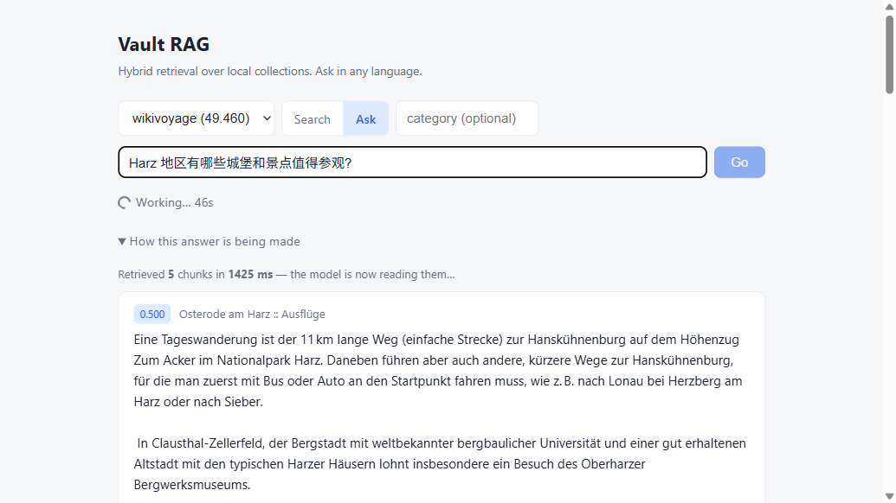
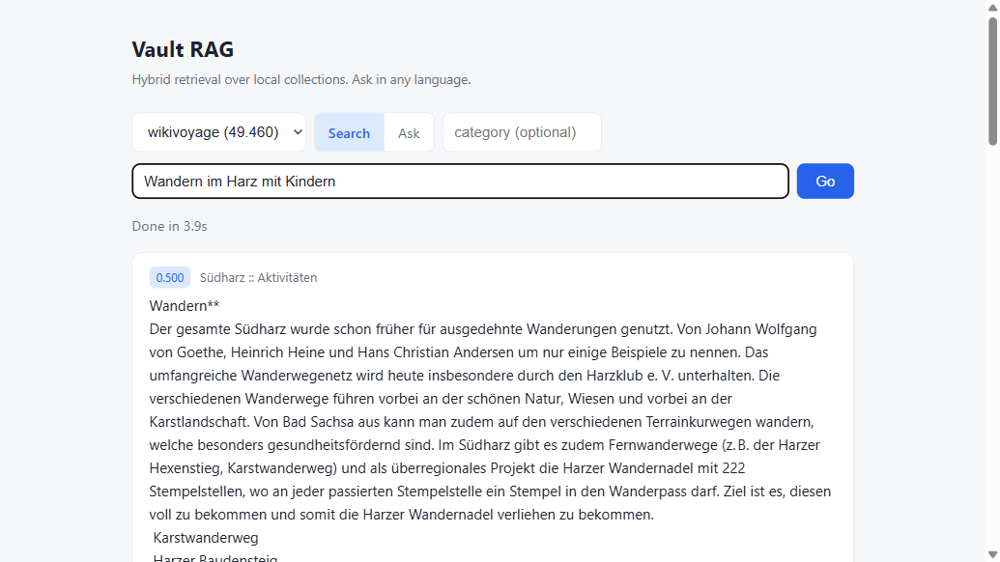
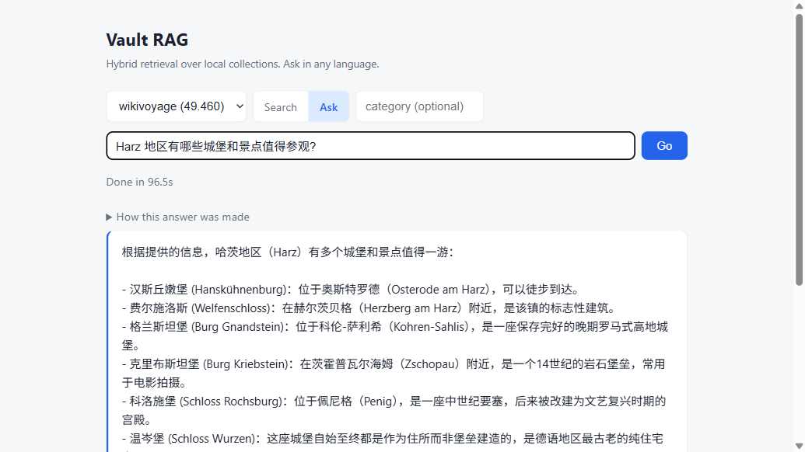
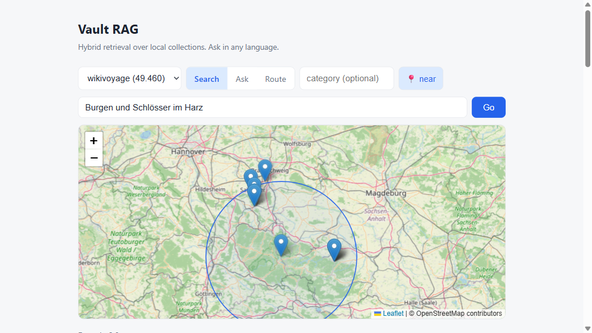
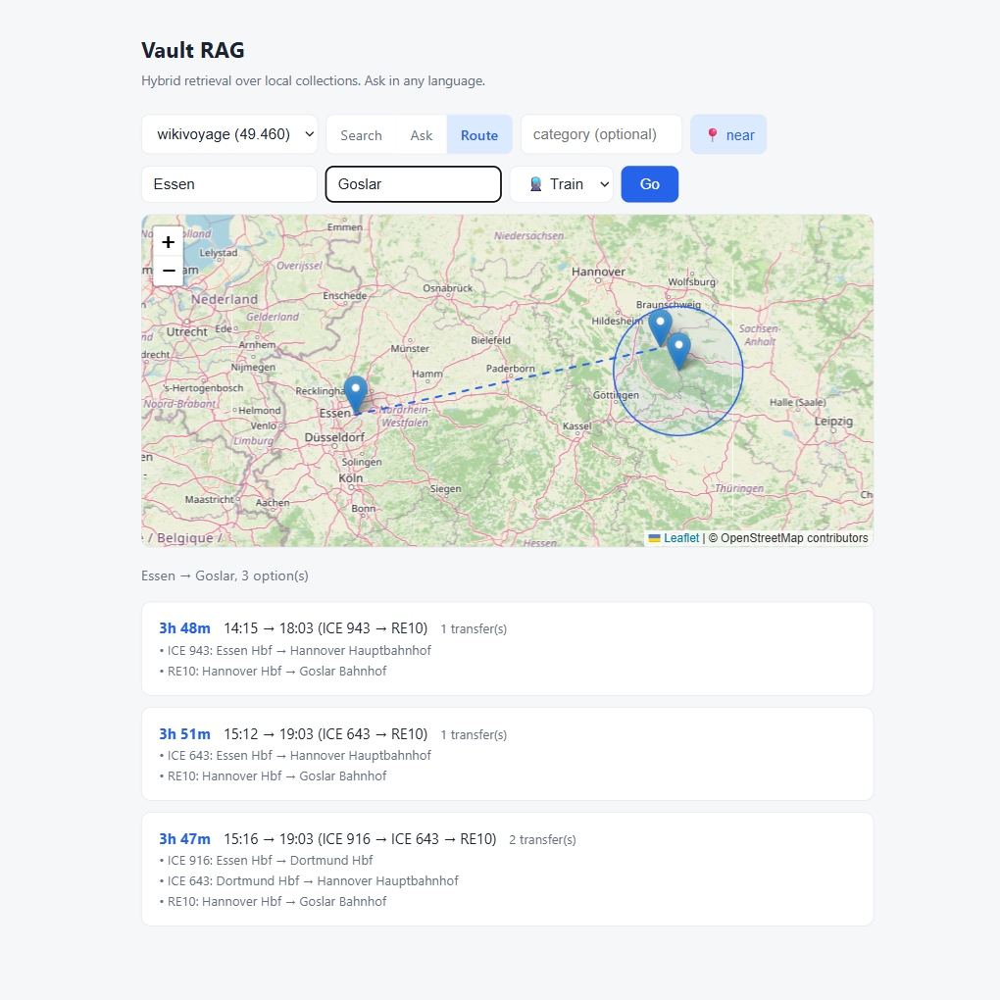

# Vault RAG

Hybrid retrieval question answering over local markdown corpora. Notes are chunked by heading, embedded twice (dense multilingual vectors and BM25 sparse vectors), stored in Qdrant, fused with Reciprocal Rank Fusion, and answered by an LLM with source citations. The AI pipeline runs locally by default; the answering model is a local Ollama model, the Claude API, or — for public collections only — Groq's fast cloud model, selected per collection. Private notes never leave the machine.

Built and tested on two corpora: a personal Obsidian vault (371 chunks) and the German Wikivoyage travel guide (49,460 chunks), indexed by the included data pipeline.



## What it does

- **Hybrid retrieval**: dense semantic search (bge-m3, 100+ languages) plus BM25 keyword search, fused with RRF. Semantic paraphrase and exact terms both hit.
- **Cross-language**: ask in Chinese or English over a German corpus. One embedding space for all languages.
- **Grounded answers with citations**: the LLM answers only from retrieved chunks and lists its sources. When retrieval finds nothing relevant, it says so instead of guessing.
- **Transparent pipeline**: every answer streams over SSE with a live trace. You watch the retrieved chunks appear, then the answer generate token by token, then the process panel collapses into an expandable "How this answer was made" summary with timings.
- **Map aware**: 179k POI coordinates extracted from the corpus live in the payload. Results plot on a Leaflet map, and a geo-radius filter turns "castles in the Harz" from a semantic guess into a spatial guarantee.
- **A-to-B routing**: train connections (real timetables) and driving routes with durations, using the corpus itself as the geocoder. Two independent free transit backends with automatic failover.
- **Incremental indexing**: a Prefect flow compares file hashes and re-embeds only changed files.
- **Two deployment modes**: embedded Qdrant on disk for zero-setup local use, or Docker Compose (Qdrant server + API) when the corpus outgrows brute-force search.

## Web UI

A single static page served by the API. Collection switcher, search and ask modes, streaming output, error surfacing. No build tooling, no framework, no keys in the browser.

| Search mode | Ask mode (answer with sources) |
|---|---|
|  |  |

The second screenshot shows a Chinese question answered from German source articles, with the retrieval trace collapsed above the answer.

## Map search and routing

Wikivoyage articles carry coordinates in their POI templates (vCard/Marker). The pipeline extracts them into the chunk payload without re-embedding anything: each chunk gets its article centroid for geo-radius filtering plus the POIs mentioned in its own text for map pins. Qdrant filters by geo radius natively, combined with the hybrid retrieval in one query.



Why it matters: the query "Burgen und Schlösser im Harz" without the filter happily returned castle chunks from the Rhine valley, 200 km away. Text similarity knows what a castle is, not where the Harz ends. The map filter makes location a hard constraint instead of a soft hint.

The Route mode answers "how do I get from A to B and how long does it take". Place names resolve against the corpus itself (every geotagged article doubles as a gazetteer entry), then free public services do the actual routing: OSRM for driving, the DB REST API for rail with Transitous (MOTIS) as automatic fallback, because community APIs have outages and a demo that dies with its single upstream is not a demo.



Boundary note: the AI pipeline (embedding, retrieval, generation) stays fully local. Map tiles and routing calls go to public services and carry only place names and coordinates, never corpus content.

## Architecture

```
                    ┌──────────────────────────────────────────┐
                    │                Indexing                  │
 markdown files ──▶ chunking by ## heading ──▶ bge-m3 (dense) ─┐
                    │                     └──▶ BM25 (sparse) ──┤
                    └──────────────────────────────────────────┼──┐
                                                               ▼  │
                                                      ┌────────────────┐
                                                      │     Qdrant     │
                                                      │ named vectors: │
                                                      │ dense + sparse │
                                                      └───────┬────────┘
                    ┌─────────────────────────────────────────┼─────┐
                    │                 Query                   ▼     │
 question ──▶ guard ──▶ embed both ways ──▶ prefetch d+s ──▶ RRF    │
                    │           (+ RBAC deny filter)            │   │
                    │               top-k chunks ◀─────────────┘    │
                    └────────────────┬──────────────────────────────┘
                                     ▼
              provider per collection: Ollama (local, private notes)
              · Claude API · Groq (cloud, public data only)
                                     ▼
                     streamed answer + citations + trace
```

## Quick Start

Requirements: Python 3.11, about 3 GB disk for the embedding model. CPU is enough.

```bash
git clone https://github.com/ZhaoyuWu/RAG-wikivoyage
cd RAG-wikivoyage
python -m venv venv
venv/Scripts/activate        # Windows; on Linux/macOS: source venv/bin/activate
pip install -r requirements.txt

# Point at your own markdown folder
copy .env.example .env       # then edit VAULT_PATH

# 1. Full index (first run downloads the bge-m3 model, ~2.3 GB)
python -m src.indexer

# 2. Start the API, open http://localhost:8000 for the web UI
#    (Swagger stays available at /docs)
uvicorn src.api:app --port 8000
```

For the ask mode, either install [Ollama](https://ollama.com), pull a model (`ollama pull qwen2.5:7b-instruct`) and set `LLM_PROVIDER=ollama` in `.env`, or set `ANTHROPIC_API_KEY` to use the Claude API. Optionally set `GROQ_API_KEY` to route public collections (listed in `CLOUD_COLLECTIONS`) to Groq's fast cloud model while private notes stay local. Search mode needs no LLM at all.

### Docker

```bash
docker compose up --build
```

Starts a Qdrant server plus the API container. Set `QDRANT_MODE=server` when running the indexer against it.

### Incremental re-index

```bash
python -m flows.reindex_flow
```

Compares md5 hashes stored in the payload against the files on disk, then re-embeds only changed files and deletes chunks of removed files.

### Multi-user mode (optional)

```bash
# generate a hash, put name:hash:role into APP_USERS, set JWT_SECRET
python -m src.auth "my-password"
# then run with auth on:
AUTH_ENABLED=1 uvicorn src.api:app --port 8000
```

With `AUTH_ENABLED=0` (default) the API is open for single-user local use.

### Retrieval benchmark & evaluation

```bash
python -m scripts.bench_hnsw     # P50/P95 retrieval latency for this backend
python -m eval.run_eval          # golden-set hit rate + faithfulness
```

## Hybrid vs Dense: why both?

Dense embeddings handle semantic paraphrase: the query "换了雇主社保和养老金要注意什么" (what about social insurance and pension after changing employers) finds the pension notes even though they never use that phrasing. BM25 handles exact rare terms that embedding models dilute: proper nouns, product names, error codes.

Measured example, query `"Riester 值得买吗"` (a German pension product name):

| Rank | Dense only (cosine) | Hybrid (RRF) |
|---|---|---|
| 1 | pension note, 0.4427 | pension note, **0.8333** |
| 2 | pension note, 0.4408 | pension note, **0.8333** |
| 3 | hiking trip note, 0.4407 | hiking trip note, 0.2500 |

With dense vectors alone, an irrelevant hiking note scores within 0.0001 of a correct hit, so a slightly different query flips the ranking. The BM25 leg matches the literal token "Riester" and the fusion separates the correct chunks decisively.

The flip side, first measured then fixed: cross-language retrieval weakened on transliterated proper nouns. "哈茨山区" (the Chinese transliteration of Harz) did not anchor to the region, because the BM25 leg had no German token to match. The eval quantified the damage — transliterated place names were the main drag, holding hit rate at 56%. The fix (`src/aliases.py`) appends the German spelling of any known transliteration to the query, so BM25 gets its exact token back. Golden-set hit rate went from 56% to 100%. It is a deterministic lookup table, not a model guess — proper-noun mapping is knowledge, not inference.

## Scaling case study: 371 to 49,460 chunks

To test the stack beyond a personal vault, a second pipeline (`pipelines/wikivoyage/`) indexes the German Wikivoyage dump: 20,968 articles streamed from the official XML export, cleaned from wikitext to markdown (POI templates rendered as text, section headings preserved), filtered to the 3,873 Germany articles via the IstIn breadcrumb graph, and embedded into a separate collection of 49,460 chunks.

```bash
python -m pipelines.wikivoyage.parse            # dump -> articles.jsonl
python -m pipelines.wikivoyage.build --scope germany
```

Lessons that only showed up at this scale, all reproducible in the git history:

- A 64-text benchmark predicted 3.5 chunks/s; production ran at 0.6. Mixed-length batches pad every text to the longest member, and sustained load throttles a laptop CPU in ways a short benchmark never sees. Length-sorted batching plus a 512-token cap roughly doubled real throughput.
- A 6-hour job needs to survive interruption. Upserts happen per article batch, so a resumed run skips completed articles by comparing stored file hashes; transient disk errors (external USB drive) are retried with backoff instead of killing the run.
- Query latency on 49k chunks is ~1.2s in embedded local mode, which does exact brute-force search. That is the point where switching to the Docker Qdrant server (HNSW index) stops being over-engineering, which is why both modes exist behind one config switch.

## Production hardening

A demo becomes a product across a few layers the happy path never touches.
Each is implemented here in a single-node form that keeps the enterprise
API contract:

- **Auth & RBAC** — JWT bearer tokens over PBKDF2 hashes (`AUTH_ENABLED=0`
  keeps local mode open). Roles filter **retrieval itself**: a restricted
  user's answer can never quote a document they may not read.
- **Prompt-injection defense** — a regex + LLM input guard, plus excerpt
  isolation that both tags and *sanitizes* retrieved text. A poisoned-doc
  experiment showed tag declaration alone wasn't enough; sanitizing was.
- **Rate limits & cost guardrail** — per-user sliding window; a daily
  cloud-call budget degrades to the local model.
- **Audit log** — append-only JSONL: who asked what, which documents
  backed each answer (answers stored as a hash, not text).
- **Metrics & evaluation** — Prometheus `/metrics` (latency histogram,
  provider mix, guard blocks) and an offline golden-set eval measuring
  retrieval hit rate and LLM-judged faithfulness, run as a Prefect flow.
  The eval drives real decisions: it measured the reranker lifting hit rate
  from 56% to 80% (+24pp) at an ~8-10s/query CPU cost — so it ships opt-in,
  not on by default.
- **Server-side conversations** — SQLite store; a conversation can be
  exported to markdown and re-indexed into the vault.

See [SECURITY.md](SECURITY.md) for the data boundaries and threat model.

## Tech

| Component | Choice |
|---|---|
| Vector store | Qdrant (embedded local mode or Docker server) |
| Dense embedding | BAAI/bge-m3 via sentence-transformers (PyTorch) |
| Sparse embedding | BM25 via fastembed |
| Fusion | Qdrant Query API prefetch + RRF |
| Reranker (optional) | BAAI/bge-reranker-v2-m3 cross-encoder |
| API | FastAPI + pydantic v2, SSE streaming |
| Generation | Ollama (local), Groq (cloud, public data), or Claude API |
| Auth | JWT (PyJWT) + PBKDF2, role-based retrieval filtering |
| Observability | Prometheus text metrics, JSONL audit log |
| Orchestration | Prefect (incremental re-index + evaluation flows) |
| Frontend | Single static HTML page, no build step |

## Privacy

Corpus text only ever reaches the local Qdrant store and, when the Claude provider is selected, the Claude API. Nothing in `qdrant_db/`, `data/` or `.env` is committed. The repository contains code only.
